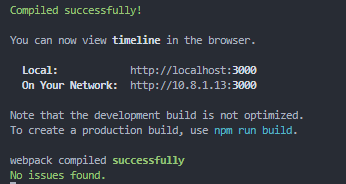

# Тестовое задание

[Описание](https://docs.google.com/document/d/1Qy4MN7duYzm-Wr-rQ4TFApvUoxfuqGXdcyA8-vt5Dhg/edit?tab=t.0#heading=h.arjd18qpb9a9)

## Выполнил

**Пацинко Евгений**

* [Портфолио работ](https://evgeny.lol/)
* [Проекты на GitHub](https://github.com/feverus)
* Telegram: @feverus

## Запуск

Самый быстрый способ в режиме рахработчика.

1. В программе visual studio code в консоли последовательно выполнить команды:

* npm i
* npm start

2. Проверить в консоли VScode, что сервер успешно поднялся на 3000 порту

4. В браузере открыть:

* http://localhost:3000/

## Пояснение к работе

* Основной компонент src\features\timeline может использоваться отдельно, если передать в него timelineData.
  Для демонстрации имитируется загрузка данных с внешнего сервиса с задержкой и размещением в store с помощью кнопки "Обновить".
  При обновлении данные "перемешиваются", таким образом можно посмотреть внешний вид при разном количестве элементов.
* Использован create react app, т.к. в требованиях был webpack. Для удобства (алиасы путей) был добавлен пакет craco. В реальной работе я бы рекомендовал использовать современный сборщик vite (2 года им пользуюсь).
* gsap не задействована, т.к. анимации использованы довольно простые.
* В работе я не гнался за pixel perfect чтобы не затягивать время выполнения. В реальной работе проект был бы передан дизайнеру для формирования критичных правок.
* Мобильная версия "включается" при размере окна меньше 1280px. Это не оптимальный вариант, но он гарантирует работу на всех устройствах. Компонент animateCircle скрывается не с помощью css,а  средствами js, т.к. имеет тяжелую логику и должен быть отключен.

**Надеюсь получить обратную связь 🤝**

